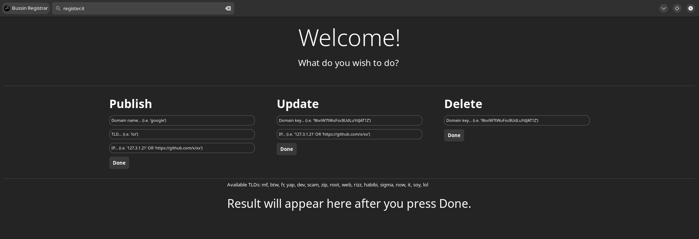

# Bussin Web X

An alternative to the World Wide Web (`http(s)://`), with:
- its own **custom browser** written in Rust with [GTK](https://gtk.org/),
- custom HTML, CSS and ***Lua*** engine (yup, **no javascript! 🎉**),
- custom **DNS** allowing Top-Level domains such as `rizz`, `sigma`, `lol`, `dev`, etc,
- and **search engine** at `buss://dingle.it`.



# File structure
- `/napture` - The source code for the **browser** Bussin Napture, used to view buss:// sites.
- `/dns` - The source code for the **DNS** (Domain Name System), used for the API at `https://api.buss.lol`
- `/dingle` - The source code for the official **search engine** (API) of Web X. For the frontend, check [dingle frontend repo](https://github.com/face-hh/dingle-frontend)
- [registrar](https://github.com/face-hh/webx-registrar) - The source code for `buss://register.it`, frontend for `https://api.buss.lol` made for Bussin Web X. This can also serve as an example for how buss:// sites are made.

# Download and Install
## Arch Linux
- `yay -S napture`, it's available on AUR.
## Nix[OS]

**Flakes**: The repository provides a flake which exposes an overlay providing the webx package, so you could just add the input in your flake.nix file

```nix
{
    inputs = {
        webx.url = "github:face-hh/webx";
    };
}
```

Then add it to your overlays and install it

```nix
{ inputs, ... }: {
    nixpkgs.overlays = [
        inputs.webx.overlays.x86_64-linux.default
    ];
}
```

> For now, only tested on x86_64-linux, but may work on others aswell, just change the arch

Add it to either home.packages (home manager) or environment.systemPackages (global packages).

```nix
home.packages = with pkgs; [
    webx
];
```

Then you could just launch it using `webx` in your terminal.

## Linux
- For now, you have to download [Rust](https://www.rust-lang.org/tools/install). Then, you just need to open `install-linux.sh` in the `napture` folder as an executable (if you can't execute it, first do `sudo chmod +x ./install-linux.sh`, then you should be able to install).
## macOS
- For now, you have to download [Rust](https://www.rust-lang.org/tools/install) and [Homebrew](https://brew.sh). Then, you just need to open `install-macos.sh` in the `napture` folder as an executable (if you can't execute it, first do `chmod +x ./install-macos.sh`, then you should be able to install).
## Windows
- Install the executable from the release tab. It's a self-extractor with WinRAR because it has a lot of DLLs.

# Download and Compile
## Linux
Install [Rust](https://www.rust-lang.org/tools/install) if you haven't already.
It should work by default, but if you're getting errors such as "missing PC files", you should Google it. Most likely you just have to install a library

## Windows
Welcome to Gaming OS 🙂
1. Download [Rust](https://www.rust-lang.org/tools/install)
2. Download GNU target: `rustup toolchain install stable-gnu && rustup default stable-gnu`
3. Download [MSYS32](https://www.msys2.org/)
4. Open MSYS32 MINGW32
5. Run: `pacman -Syu` just in case.
6. Run `pacman -S mingw-w64-x86_64-toolchain base-devel mingw-w64-x86_64-gtk4 mingw-w64-x86_64-gettext mingw-w64-x86_64-libxml2 mingw-w64-x86_64-librsvg mingw-w64-x86_64-pkgconf mingw-w64-x86_64-gcc mingw-w64-x86_64-libadwaita mingw-w64-x86_64-lua`
7. Go to `Settings` -> `Search` and open `Advanced system settings` -> Click on `Environment variables` (or just search "path")
8. Select `Path` -> Click on `Edit` -> Add the following three entries: `C:\msys64\mingw64\include`, `C:\msys64\mingw64\bin`, and `C:\msys64\mingw64\lib`.
9. Open a terminal in the folder with `napture/`, run `cargo run`.

## MacOS (Apple Silicon)
1. Install [Rust](https://www.rust-lang.org/tools/install)
2. Install [Homebrew](https://brew.sh/)
3. Install PKG_CONFIG_PATH and ensure it's set in your path

```bash
brew install pkg-config
which pkg-config
```

3.1. Should return something like `/opt/homebrew/bin/pkg-config`. If it doesn't, add it to your path.

4. Install GTK and Necessary Libraries

```bash
brew install glib
brew install gobject-introspection
brew install graphene
brew install gdk-pixbuf
brew install pango
brew install gtk+4
brew install libadwaita
brew install lua@5.4

brew --prefix glib
brew --prefix gobject-introspection
brew --prefix graphene
brew --prefix gdk-pixbuf
brew --prefix pango
brew --prefix gtk4
brew --prefix libadwaita
brew --prefix lua@5.4
```

4.1 Validate if the libraries are installed adequately and set in PKG_CONFIG_PATH, command below should return the path to the libraries without any errors.

```bash
pkg-config --libs --cflags glib-2.0
pkg-config --libs --cflags gobject-2.0
pkg-config --libs --cflags graphene-gobject-1.0
pkg-config --libs --cflags gdk-pixbuf-2.0
pkg-config --libs --cflags pango
pkg-config --libs --cflags gtk4
pkg-config --libs --cflags libadwaita-1
pkg-config --libs --cflags lua-5.4
```

5. Run `cargo run` in the `napture/` directory.

```bash
cd napture

cargo build
# or
cargo run
```

# Register website
Please follow [How to code a Buss site](https://facedev.gitbook.io/bussin-web-x-how-to-make-a-website/) for a better visual guide.

So you wish to publish a website to Web X? Great! Let's go through the rules:

1. If your website contains Not Safe For Work material of any kind, it will be removed.
2. If your website contains frequent racial slurs, references made in bad faith to tragic events, racism towards other races, or anything of that kind, it will be removed.
3. If your website is dedicated to the publication of private information, it will be removed.
4. If your website is actively engaged in leaking information about incoming traffic (i.e., posting the IPs of users), it will be removed.
5. If your website displays content that violates law or regulations, including but not limited to, piracy, hacking, or illegal activities such as drug usage, will result in a removal.
6. If your website contains or distributes malware, viruses, or any other harmful software, it will be removed.
7. If your website is dedicated to harassment, bullying, or targeted attacks against individuals or groups, it will be removed.
8. If your website infringes upon intellectual property rights of others, it will be removed.
9. If your website is involved in fradulent activities, scams, or deceptive practices, it will be removed.
10. If your website contains content that encourages harmful behavior, including self-harm, suicide, substance abuse, or dangerous challanges, it will be removed.

By publishing content to this platform ("Bussin Napture"/"Bussin Web X"), you agree to comply with all rules and regulations set forth by the administrators. The administrators reserve the right to interpret and enforce these rules at their discretion. To report websites that are not following the listed rules, please contact `FaceDev` on either [Twitter](https://twitter.com/facedevstuff) or [Discord](https://discord.gg/cNwWvdWj42).

Now, to register a website, navigate to `buss://register.it` **through Bussin Napture**.

You will see this interface.


What you need is the **Publish** section.
- for the domain name, choose whatever you want. (example: `duckduckgo`)
- for the TLD, choose one displayed above the `Result will appear...` label. (example: `rizz`)
- for the IP, you can either use:
   - an IP that serves `/index.html` on port 80
   - a GitHub repository that has `index.html`, **outside any folder**. (example: [registrar](https://github.com/face-hh/webx-registrar)), ***with the `main` default branch***.

Don't worry! The IP doesn't have to be valid, and you can save the domain for later!

**WARNING**: After creating the domain, you'll be shown a **secret key**. Please make sure to save it as you will need it to Update/Delete your domain.

# Run website locally
Bussin Napture fetches `index.html` at whatever path you give it. For example, if you enter `http://localhost:3000`, Napture will fetch `http://localhost:3000/index.html`. From the index.html, if you have further `<link>` or `<script>` imports, they will be fetched at `http://localhost:3000/file.(css|lua)`.

1. To locally test a website, you can use something like [Python](https://www.python.org/):
```bash
python -m http.server 3000
```
2. CLI support with `./napture file:///home/path/to/folder`.
3. Enter `file:///home/path/to/folder` in the search bar.

# HTML guide
The supported tags are: `head`, `title`, `link`, `meta`, `script`, `h1`-`h6`, `div`, `p`, `ul`, `ol`, `li`, `div`, `button`, `hr`, `img`, `input`, `textarea`, `button`, `select`, `option`. Keep in mind their syntax may be different if you're already familiar with HTML5 (i.e. `link` is used for the tab icon). Please check [registrar](https://github.com/face-hh/webx-registrar) or `/napture/test/index.html` for examples.

# CSS guide
The supported properties are:
- `border-color`
- `border-width`
- `border-style`
- `border-radius`
- `padding`
- `direction` (row | column)
- `align-items`: (fill | start | center | end)
- `gap`
- `color`
- `font-size`
- `font-height`
- `font-family`
- `font-weight` (ultralight | light | normal | bold | ultrabold | heavy)
- `underline` (none | single | double | low | error)
- `underline-color`
- `overline` (none | single)
- `overline-color`
- `strikethrough` (false | true)
- `strikethrough-color`
- `margin-left`
- `margin-right`
- `margin-top`
- `margin-bottom`
- `width` (only on `<input>` & `<textarea>`)
- `height` (only on `<input>` & `<textarea>`)

Properties whose value type wasn't specified are either measured in `px`, or are colors (`#fff`, `red`, etc.)

# Lua guide
For those coming from the traditional web...
```diff
- 1. const test = document.querySelector(".classExample");
- 2. test.textContent = "abc";
- 3. test.href = "https://ok.test"
- 4. console.log(test.href)
- 5. test.addEventListener("click", () => {})
- 6. test.addEventListener("submit", () => {})
+ 1. local test = get("classExample")
+ 2. test.set_content("abc");
+ 3. test.set_href("buss://register.it")
+ 4. print(test.get_href())
+ 5. test.on_click(function())
+ 6. test.on_submit(function())
```

I believe you'd get a better understand if you explored the [registrar](https://github.com/face-hh/webx-registrar) repository's `script.lua`.

NOTE: Bussin Napture doesn't support `buss://` redirects yet. They will be added in the official release.

Made by FaceDev with pure utter hatred and undesire :D
