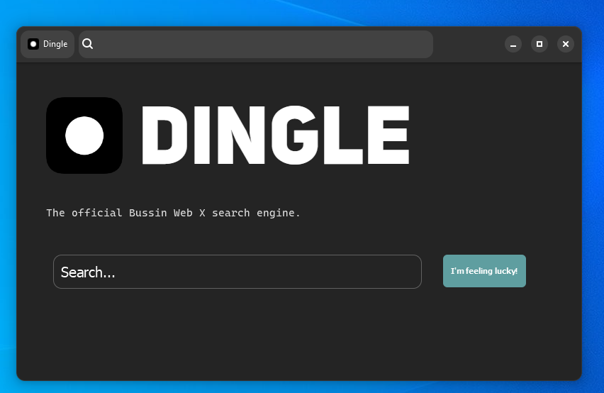

# User manual

## First thing first: Install Napture.

<figure><figcaption><p>Bussin Napture v1.2.2</p></figcaption></figure>

This is the guide to install **Bussin Napture**, the official Web X browser.

### Linux

* Download [Rust](https://www.rust-lang.org/tools/install). Then, you just need to open `install-linux.sh` as an executable (if you can't execute it, first do `sudo chmod +x ./install-linux.sh`, then you should be able to install).

### macOS

* Download [Rust](https://www.rust-lang.org/tools/install) and [Homebrew](https://brew.sh). Then, you just need to open `install-macos.sh` as an executable (if you can't execute it, first do `chmod +x ./install-macos.sh`, then you should be able to install).

### Windows

* Install the executable from the [release tab](https://github.com/face-hh/webx/releases). It's a self-extractor with WinRAR because it has a lot of DLLs.

### Arch Linux

Run **`yay -S napture`**. It's available on AUR.

### Nix\[OS]

**Flakes**: The repository provides a flake which exposes an overlay providing the webx package, so you could just add the input in your flake.nix file

```nix{3}
{
    inputs = {
        webx.url = "github:face-hh/webx";
    };
}
```

Then add it to your overlays and install it

```nix{3}
{ inputs, ... }: {
    nixpkgs.overlays = [
        inputs.webx.overlays.x86_64-linux.default
    ];
}
```

> For now, only tested on x86\_64-linux, but may work on others aswell, just change the arch

Add it to either home.packages (home manager) or environment.systemPackages (global packages).

```nix{2}
home.packages = with pkgs; [
    webx
];
```

Then you could just launch it using `webx` in your terminal.


Go [here](https://github.com/face-hh/webx/releases) for the releases tab. Always download the **Latest** one.


## **Next: Using it!**

It's very easy. This is your startpage:

<figure><figcaption><p>buss://dingle.it</p></figcaption></figure>

This is Dingle, WebX's official search engine. Just like a normal search engine, type in a query, and then click on one of the results to visit a website.


Websites may not have a description. That depends if the developer added a [description](../for-developers/html++.md#head-metadata-in-html) or not.

Also, don't forget you can click on the **Tab** name to bring up the **About** popup, which contains all the **shortcuts**.

And that's pretty much it! Enough to have some fun browsing the Web X.
